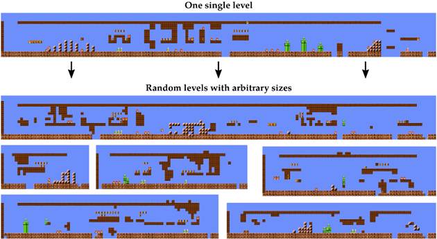
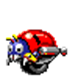
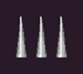
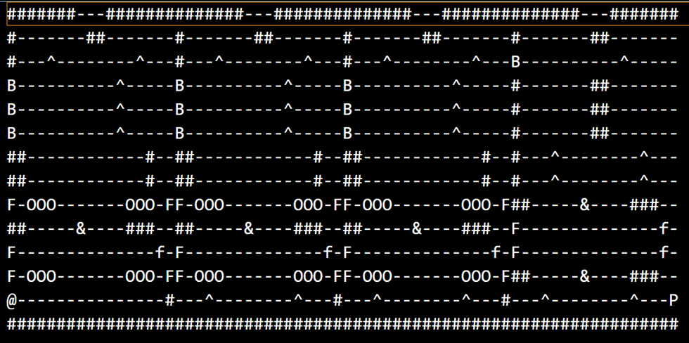

# TOAD-GAN: Procedural Generator of 2d Platform Game Levels

## Table of Contents

- [a. Introduction](#introduction)
  - [i. Context](#context)
  - [ii. State of the art](#state-of-the-art)
  - [iii. Contribution](#contribution)
  - [iv. Resources](#resources)
- [b. Work done](#work-done)
  - [i. Research and Preparation](#research-and-preparation)
  - [ii. Dataset Collection and Preparation](#dataset-collection-and-preparation)
  - [iii. Model Adaptation](#model-adaptation)
  - [iv. Level Generation](#level-generation)
  - [v. Evaluation by Reinforcement Learning](#evaluation-by-reinforcement-learning)
- [c. Conclusion](#conclusion)
- [d. References](#references)

## Introduction

This project focuses on leveraging Generative Adversarial Networks (GANs) to advance Procedural Content Generation (PCG) for 2D platform games. Specifically, it examines the application of the TOAD-GAN model, a deep learning-based approach designed to automate the generation of game levels. By utilizing TOAD-GAN, the project aims to provide a greater variety of levels and improve the replayability of platform games.

Our task is to adapt the TOAD-GAN model slightly to create a predefined workflow that will help other users apply it for level generation. For this purpose, we have chosen **Sonic the Hedgehog** as the test game, as it is more complex than Super Mario Bros or Mario Kart in terms of game difficulty and will present a more challenging task for the model.

### Context

Creating 2D game levels for platformers like **Sonic the Hedgehog** is often a tedious and repetitive task for game developers. Levels must be designed with the right balance of difficulty, layout, and visual aesthetics. While developers can create these levels manually, the process can be time-consuming and prone to limitations. With the growing interest in procedural content generation, AI is now offering an innovative way to automate this process.

### State of the art

Procedural Content Generation (PCG) has become an integral part of modern game development, enabling the automated creation of game levels, assets, and mechanics. Traditionally, rule-based approaches have dominated PCG, where developers manually define algorithms to generate content. While effective, these methods often lack the flexibility and creativity required to produce diverse and unpredictable content. To address these limitations, advancements in machine learning and deep learning have paved the way for more sophisticated PCG techniques.

**Deep Learning in PCG**

The integration of deep learning into PCG has transformed the landscape of content generation. Neural networks, particularly Convolutional Neural Networks (CNNs) and Recurrent Neural Networks (RNNs), have been widely used to analyze and generate game content. These models excel at learning patterns and structures from data, enabling them to mimic human-designed levels. However, their reliance on predefined datasets and supervised learning has highlighted a need for more generative and unsupervised methods.

**Generative Adversarial Networks (GANs)**

Introduced by [Ian Goodfellow et al. in 2014](https://arxiv.org/abs/1406.2661), GANs represent a breakthrough in generative modeling. GANs consist of two neural networks, a generator and a discriminator, that compete with each other to produce realistic outputs. This architecture has been widely adopted in PCG to generate high-quality game levels. GANs are particularly effective in creating novel and diverse content while maintaining structural coherence.
Applications of GANs in PCG include generating levels for games like Super Mario Bros., Doom, and The Legend of Zelda. For instance, MarioGAN has been used to generate levels for Super Mario Bros., showcasing the potential of GANs in replicating and expanding upon classic game designs. Despite their success, traditional GAN models often struggle with issues such as mode collapse, where the generator produces limited variations of content, limiting the diversity of generated levels.
 

Fig 1: Example of levels generated by TOAD-GAN model

**TOAD-GAN**

TOAD-GAN (Topology-Aware GAN for 2D Games) builds upon the foundation of traditional GANs by introducing topology-awareness into the generation process. Developed specifically for 2D platformers, TOAD-GAN addresses the need for maintaining structural integrity in generated levels. Unlike other GAN models, TOAD-GAN ensures that the levels are not only visually appealing but also functional and playable, a critical aspect of game design.
TOAD-GAN uses a patch-based approach to generate levels, allowing it to create large, continuous game worlds while preserving local structures. This makes it particularly suitable for games with complex topologies, such as Sonic and Castlevania. By training on datasets of existing game levels, TOAD-GAN learns to replicate the design principles of the original games while introducing novel variations.

### Contribution

This project takes **Toad GAN** and adapts it specifically for **Sonic the Hedgehog** 2D platform game levels. We have modified the GAN architecture to generate levels with the same style and difficulty as the original Sonic levels. Additionally, we've incorporated **reinforcement learning** to evaluate and improve the generated levels based on player feedback, enabling the model to fine-tune itself over time.

### Resources

**Datasets**: 
- 2D levels from Sonic the Hedgehog.

**Main Libraries**:
- **PyTorch** for model training and generation.
- **wandb** for logging and visualization.
- **tqdm** for progress bars.

**Hardware**:
- Local computers.

**Techniques and Algorithms**:
- **Toad GAN** for generating game levels.
- **Reinforcement Learning (RL)** to evaluate and refine the levels.

**Team**:
- Developed by **Aivancity 3rd year students** (see below) in collaboration with **ISART Digital**:
* **[Axel ONOBIONO](https://www.linkedin.com/in/axel-onobiono/)**
* **[Florian HOUNKPATIN](https://www.linkedin.com/in/florian-hounkpatin/)**
* **[Noémi DOMBOU](https://www.linkedin.com/in/noemi-dombou/)**
* **[Asser OMAR](https://www.linkedin.com/in/asseromar/)**
* **[Ephraim KOSSONOU](https://www.linkedin.com/in/ephraïm-kossonou/)**

## Work Done

### Research and Preparation

To lay the groundwork for the project, we undertook an exhaustive process of researching and curating sprite resources and references relevant to Sonic the Hedgehog. Given Sonic's unique and visually rich aesthetic, it was essential to identify sprites that accurately captured the game's distinct level elements, including platforms, hazards, and background assets.

-	**Sprite Collection:**

Sprites were sourced from publicly available repositories and fan communities dedicated to Sonic games. These resources included tilesets, character animations, and environmental features. To adhere to project deadlines and simplify the physical logic of levels, we opted to exclude complex structures like semi-curved ground, loops, and dynamic motions for rings and enemies. Instead, static sprites were used for these elements, as their absence minimally impacts gameplay or difficulty during testing.

Below are examples of sprites used in this project:

 
Fig 2: Sonic sprite sheet

 
Fig 3 : Background sprite sheet

 
Fig 4 : Ring sprite sheet

 
Fig 5: Goal post sprite 
 
 

Fig 6: Enemy sprite

 
Fig 7: Trap sprite

-	**Sprite Adaptation:**

Many of the collected sprites required modification to fit the specific requirements of the TOAD-GAN model.

This process was critical to ensuring the compatibility of the sprites with the training and generation pipeline.

### Dataset Collection and Preparation

The dataset forms the backbone of any machine learning project.
- **Level Data Acquisition:**

For this project we used an AI generated ASCII Level of the sonic level. An explanation of each token is provided below in our project [tokens.py](https://github.com/vsx23733/SONIC-GAN/blob/main/sonic/tokens.py):

Fig 8: Input level 1-2 for sonic (AI generated)

**- Simplification and Refinement**:

Logical rules were implemented to maintain game physics and level integrity, such as:
1. Spikes (traps) must be placed on a flat ground block.
2. Decorative elements (flowers, trees) are ground dependent.
3. Enemies can be in the air or on the ground but not in water.
4. Goal posts must always sit atop ground blocks.

Since the GAN-based approach doesn’t require large dataset to be functional, we haven’t spent that much time designing the level, knowing that we could come back to this step after the adaptation of the TOAD GAN will be made.

The levels we’ve manually made are of course more complex than Mario levels, but don’t carry the whole complexity of Sonic’s game. It’s more like a level snippet. 

### Model Adaptation

Next, we adapted the original Toad GAN model to generate levels specifically for Sonic. This involved tweaking the architecture to ensure that the generated levels matched the game's style and challenges. We also optimized the model for training on **Sonic-like levels**, paying attention to the different scales and features that make up the game levels, such as obstacles, ramps, and enemy placements.

### Level Generation

Once the dataset and model were prepared, we began the level generation phase. This involved running iterative experiments to produce a diverse set of level designs while monitoring and fine-tuning the model's performance.
- **Generation Workflow:**
  -	Levels were generated with varying parameters, analyzed for structural coherence, and refined by adjusting hyperparameters like patch size and learning rate.

- **Iterative Refinement:**
After each generation cycle, we analyzed the outputs for:
  - **Playability**: Ensuring that characters can navigate through the levels seamlessly.
  - **Visual Consistency**: Matching the design principles of the original Sonic games.
  - **Structural Integrity**: Verifying the logical presence of crucial elements, such as platforms and hazards, in logical arrangements.

**Model parameters**
----------------

During the iterative part, we tried to manipulate the hyperparameters of the model as the TOAD-GAN is not specific to one game, a bad output should be related to the hyperparameters (at least that’s the conclusion we came up with) and it worked well as it improved our result over iterations. An explanation of all hyperparameters ca be found in our project [README](https://github.com/vsx23733/SONIC-GAN/blob/main/README.md)

### Evaluation by Reinforcement Learning

To further refine the generated levels, we implemented **Reinforcement Learning** (RL) techniques to evaluate the levels based on player feedback. The idea behind this is to let the AI "play" through the generated levels and reward it for creating levels that provide a balanced challenge. If a generated level is too easy or too hard, the model can adjust its parameters to improve the level’s quality.

## Conclusion

This project marks the first step in automating the process of 2D platform game level creation using AI. The success of Toad GAN in generating levels for Sonic shows that we are on the right path. With continuous improvements, this method could be expanded to generate levels for other games and genres, enhancing the game development process in the future.

Stay tuned for more updates and feel free to contribute to this exciting journey!

---

**Follow the project on GitHub**: [Project Repository](https://github.com/vsx23733/SONIC-GAN)

Feel free to check out the code, contribute to improvements, and experiment with generating new levels for Sonic!

## References

- [Generative Adversarial Networks](https://arxiv.org/abs/1406.2661)
- [TOAD-GAN: Coherent Style Level Generation from a Single Example (AAAI 2020)](https://arxiv.org/abs/2002.11463)
- [GitHub Page for Sonic Toad GAN Project](https://github.com/vsx23733/SONIC-GAN)

---

Thanks for reading, and happy level designing!